# Architecture Diagrams & ASCII Representations

> **Issue #136 - Part 2**: Visual documentation of project architecture, user journeys, and component layouts
> **Generated**: 2026-02-14

## Table of Contents

1. [User Journey Mermaid Diagrams](#user-journey-mermaid-diagrams)
2. [Permission Scope Diagrams](#permission-scope-diagrams)
3. [Component Architecture](#component-architecture)
4. [ASCII Page Layouts](#ascii-page-layouts)
5. [Endpoint Mapping](#endpoint-mapping)

---

## User Journey Mermaid Diagrams

### 1. User Discovery Journey

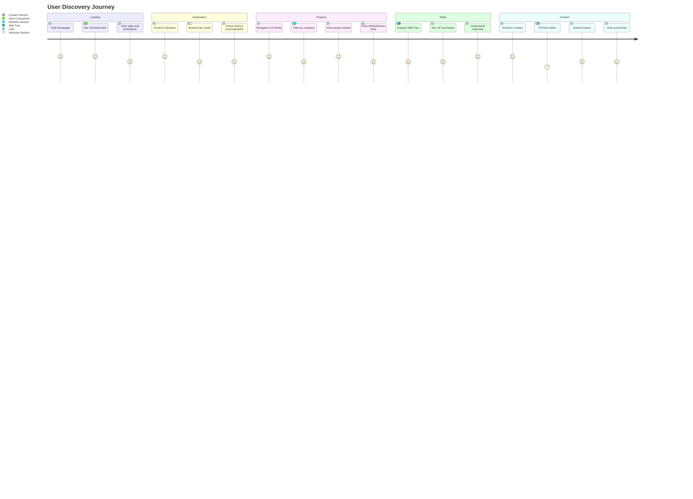

### 2. Developer Exploration Journey

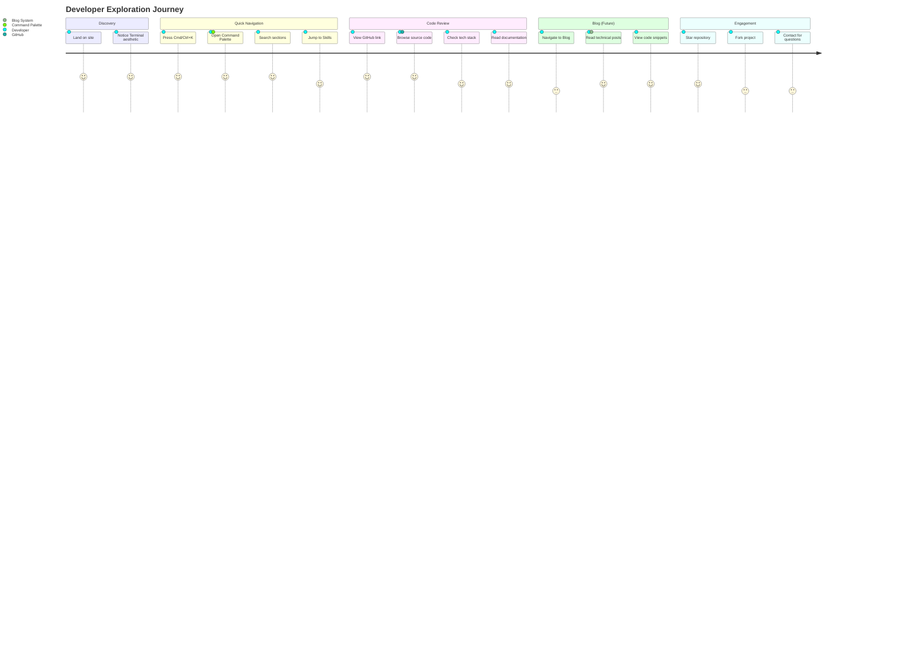

### 3. Recruiter Assessment Journey

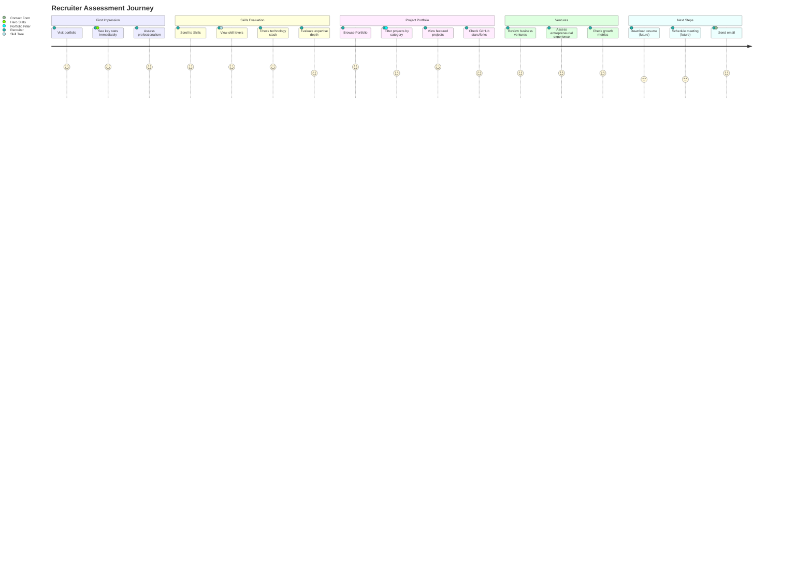

---

## Permission Scope Diagrams

### Public Access (No Auth Required)

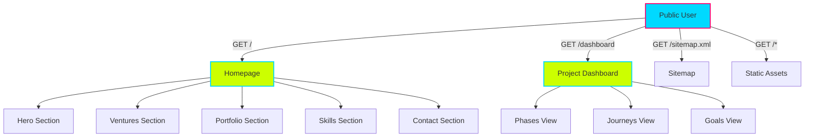

### Future: Protected Routes (Admin)

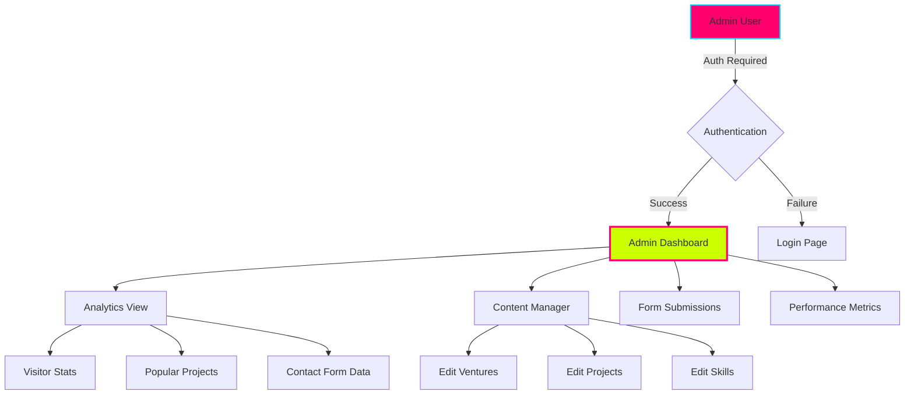

---

## Component Architecture

### Application Architecture

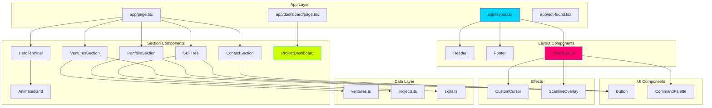

### Data Flow Diagram

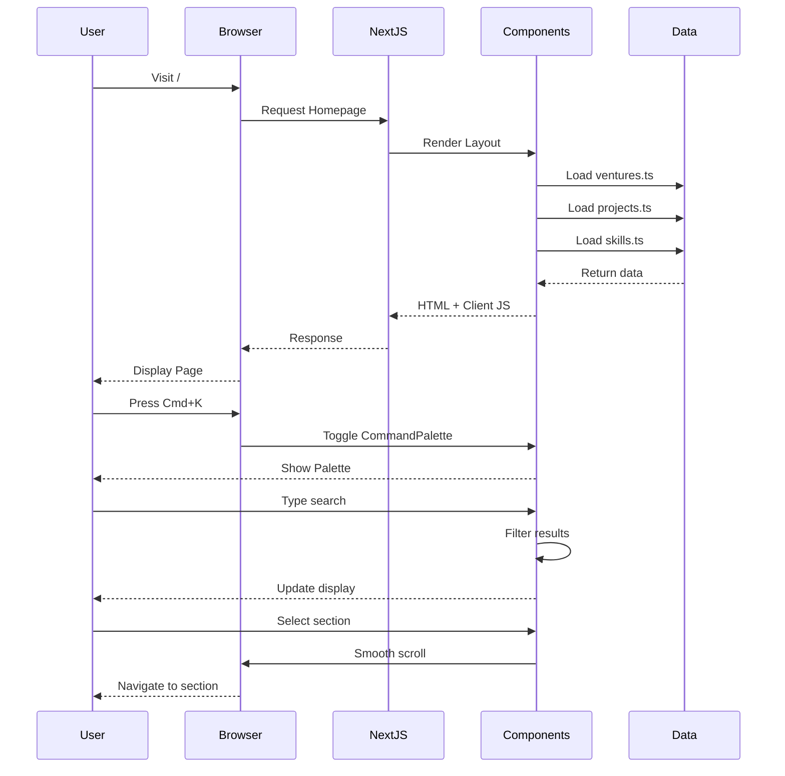

---

## ASCII Page Layouts

### Homepage - Desktop View (1920x1080)

```
┏━━━━━━━━━━━━━━━━━━━━━━━━━━━━━━━━━━━━━━━━━━━━━━━━━━━━━━━━━━━━━━━━━━━━━━━━━━━━━━━━━━━━━━━━━━━━━━━━━━━━━━━━━━━━━━━┓
┃ ▓▓▓ HEADER ▓▓▓▓▓▓▓▓▓▓▓▓▓▓▓▓▓▓▓▓▓▓▓▓▓▓▓▓▓▓▓▓▓▓▓▓▓▓▓▓▓▓▓▓▓▓▓▓▓▓▓▓▓▓▓▓▓▓▓▓▓▓▓▓▓▓▓▓▓▓▓▓▓▓▓▓▓▓▓▓▓▓▓▓▓▓▓▓▓▓▓▓▓▓▓▓▓ ┃
┃  jlucus.dev          [Home] [Ventures] [Skills] [Portfolio] [Contact] [Cmd+K Search]       [@GitHub] [@LinkedIn] ┃
┃ ▓▓▓▓▓▓▓▓▓▓▓▓▓▓▓▓▓▓▓▓▓▓▓▓▓▓▓▓▓▓▓▓▓▓▓▓▓▓▓▓▓▓▓▓▓▓▓▓▓▓▓▓▓▓▓▓▓▓▓▓▓▓▓▓▓▓▓▓▓▓▓▓▓▓▓▓▓▓▓▓▓▓▓▓▓▓▓▓▓▓▓▓▓▓▓▓▓▓▓▓▓▓▓▓▓▓▓▓▓ ┃
┣━━━━━━━━━━━━━━━━━━━━━━━━━━━━━━━━━━━━━━━━━━━━━━━━━━━━━━━━━━━━━━━━━━━━━━━━━━━━━━━━━━━━━━━━━━━━━━━━━━━━━━━━━━━━━━━┫
┃                                                                                                                 ┃
┃  ╔═══════════════════════════════════════════════════════════════════════════════════════════════════════════╗  ┃
┃  ║ █ HERO TERMINAL ████████████████████████████████████████████████████████████████████████████████████████ ║  ┃
┃  ║                                                                                                           ║  ┃
┃  ║   ┌──────────────────────────────────────────┐     ┌────────────────────────────────────────────┐        ║  ┃
┃  ║   │ $ whoami                                 │     │  🚀 STATS                                  │        ║  ┃
┃  ║   │ > jlucus                                 │     │  ┌──────────────┐  ┌──────────────┐       │        ║  ┃
┃  ║   │                                          │     │  │  5+ YEARS    │  │  20+ PROJECTS│       │        ║  ┃
┃  ║   │ $ cat roles.txt                          │     │  │  Experience  │  │   Delivered  │       │        ║  ┃
┃  ║   │ > Engineer | Builder | Architect         │     │  └──────────────┘  └──────────────┘       │        ║  ┃
┃  ║   │                                          │     │  ┌──────────────┐  ┌──────────────┐       │        ║  ┃
┃  ║   │ $ ./build_portfolio.sh                   │     │  │  15+ SKILLS  │  │  3 VENTURES  │       │        ║  ┃
┃  ║   │ ▓▓▓▓▓▓▓▓░░░░ 75% Loading...             │     │  │   Mastered   │  │   Building   │       │        ║  ┃
┃  ║   │ _                                        │     │  └──────────────┘  └──────────────┘       │        ║  ┃
┃  ║   └──────────────────────────────────────────┘     └────────────────────────────────────────────┘        ║  ┃
┃  ║                                                                                                           ║  ┃
┃  ║   [View Ventures ➜]  [Explore Projects ➜]                                    ⚡ Animated Grid Background ║  ┃
┃  ╚═══════════════════════════════════════════════════════════════════════════════════════════════════════════╝  ┃
┃                                                                                                                 ┃
┃  ┌───────────────────────────────────────────────────────────────────────────────────────────────────────────┐  ┃
┃  │ 🏢 VENTURES SECTION                                                                                       │  ┃
┃  ├───────────────────────────────────────────────────────────────────────────────────────────────────────────┤  ┃
┃  │                                                                                                           │  ┃
┃  │   ╱▔▔▔▔▔▔▔▔▔▔▔▔╲       ╱▔▔▔▔▔▔▔▔▔▔▔▔╲       ╱▔▔▔▔▔▔▔▔▔▔▔▔╲                                              │  ┃
┃  │  ╱  VENTURE 1   ╲     ╱  VENTURE 2   ╲     ╱  VENTURE 3   ╲                                             │  ┃
┃  │ ▕  SaaS Platform ▏   ▕  AI Startup    ▏   ▕  Dev Tools     ▏                                             │  ┃
┃  │ ▕  🚀 Building   ▏   ▕  💡 Launching   ▏   ▕  📈 Growing    ▏                                             │  ┃
┃  │ ▕                ▏   ▕                ▏   ▕                ▏                                             │  ┃
┃  │ ▕  5K Users      ▏   ▕  Beta Phase    ▏   ▕  10K Stars     ▏                                             │  ┃
┃  │ ▕  +25% Growth   ▏   ▕  VC Backed     ▏   ▕  OSS Project   ▏                                             │  ┃
┃  │  ╲______________╱     ╲______________╱     ╲______________╱                                              │  ┃
┃  │                                                                                                           │  ┃
┃  │   [Next.js] [TypeScript] [AWS]     [Python] [TensorFlow]     [React] [Node.js]                          │  ┃
┃  └───────────────────────────────────────────────────────────────────────────────────────────────────────────┘  ┃
┃                                                                                                                 ┃
┃  ┌───────────────────────────────────────────────────────────────────────────────────────────────────────────┐  ┃
┃  │ 💼 PORTFOLIO SECTION                                                                                      │  ┃
┃  ├───────────────────────────────────────────────────────────────────────────────────────────────────────────┤  ┃
┃  │                                                                                                           │  ┃
┃  │   Filter: [All] [Web Apps] [Mobile] [Backend] [DevTools] [OSS]                                           │  ┃
┃  │                                                                                                           │  ┃
┃  │   ┌──────────────────────┐  ┌──────────────────────┐  ┌──────────────────────┐  ┌──────────────────────┐ │  ┃
┃  │   │ 📱 Project 1         │  │ 🌐 Project 2         │  │ 🔧 Project 3         │  │ 💻 Project 4         │ │  ┃
┃  │   │ E-commerce Platform  │  │ Analytics Dashboard  │  │ CLI Tool Suite       │  │ Social Network       │ │  ┃
┃  │   │                      │  │                      │  │                      │  │                      │ │  ┃
┃  │   │ [Featured]           │  │ ⭐ 2.5K stars        │  │ 🍴 350 forks         │  │ 👥 50K users         │ │  ┃
┃  │   │ Next.js • Stripe     │  │ React • D3.js        │  │ Node.js • Commander  │  │ MERN Stack           │ │  ┃
┃  │   │                      │  │                      │  │                      │  │                      │ │  ┃
┃  │   │ [GitHub ➜] [Demo ➜]  │  │ [GitHub ➜] [Demo ➜]  │  │ [GitHub ➜] [Docs ➜]  │  │ [GitHub ➜] [Live ➜]  │ │  ┃
┃  │   └──────────────────────┘  └──────────────────────┘  └──────────────────────┘  └──────────────────────┘ │  ┃
┃  └───────────────────────────────────────────────────────────────────────────────────────────────────────────┘  ┃
┃                                                                                                                 ┃
┃  ┌───────────────────────────────────────────────────────────────────────────────────────────────────────────┐  ┃
┃  │ 🎯 SKILL TREE SECTION                                                                                     │  ┃
┃  ├───────────────────────────────────────────────────────────────────────────────────────────────────────────┤  ┃
┃  │                                                                                                           │  ┃
┃  │   ▼ Frontend Development (5 skills) ──────────────────────────────────────────────────────────────────    │  ┃
┃  │      ├─ React.js          ▓▓▓▓▓▓▓▓▓▓ Master     (10K XP)                                                 │  ┃
┃  │      ├─ TypeScript        ▓▓▓▓▓▓▓▓▓░ Expert     (8.5K XP)                                                 │  ┃
┃  │      ├─ Next.js           ▓▓▓▓▓▓▓▓▓▓ Master     (10K XP)                                                 │  ┃
┃  │      ├─ Tailwind CSS      ▓▓▓▓▓▓▓▓░░ Advanced   (7K XP)                                                  │  ┃
┃  │      └─ Framer Motion     ▓▓▓▓▓▓░░░░ Intermediate (5K XP)                                                 │  ┃
┃  │                                                                                                           │  ┃
┃  │   ▶ Backend Development (4 skills collapsed)                                                             │  ┃
┃  │   ▶ DevOps & Cloud (3 skills collapsed)                                                                  │  ┃
┃  │   ▶ Databases (3 skills collapsed)                                                                       │  ┃
┃  └───────────────────────────────────────────────────────────────────────────────────────────────────────────┘  ┃
┃                                                                                                                 ┃
┃  ┌───────────────────────────────────────────────────────────────────────────────────────────────────────────┐  ┃
┃  │ 📬 CONTACT SECTION                                                                                        │  ┃
┃  ├───────────────────────────────────────────────────────────────────────────────────────────────────────────┤  ┃
┃  │                                                                                                           │  ┃
┃  │   ┌────────────────────────────────────┐       ┌──────────────────────────────┐                          │  ┃
┃  │   │ Contact Form                       │       │ Get in Touch                 │                          │  ┃
┃  │   ├────────────────────────────────────┤       │                              │                          │  ┃
┃  │   │ Name: [___________________]        │       │ 📧 contact@jlucus.dev        │                          │  ┃
┃  │   │ Email: [___________________]       │       │ 💼 LinkedIn: /in/jlucus      │                          │  ┃
┃  │   │ Message:                           │       │ 💻 GitHub: @4eckd            │                          │  ┃
┃  │   │ [________________________]         │       │                              │                          │  ┃
┃  │   │ [________________________]         │       │ ⚡ Response Time: < 24h      │                          │  ┃
┃  │   │ [________________________]         │       │ 🟢 Available for Projects    │                          │  ┃
┃  │   │                                    │       │                              │                          │  ┃
┃  │   │          [Send Message ➜]          │       └──────────────────────────────┘                          │  ┃
┃  │   └────────────────────────────────────┘                                                                 │  ┃
┃  └───────────────────────────────────────────────────────────────────────────────────────────────────────────┘  ┃
┃                                                                                                                 ┃
┣━━━━━━━━━━━━━━━━━━━━━━━━━━━━━━━━━━━━━━━━━━━━━━━━━━━━━━━━━━━━━━━━━━━━━━━━━━━━━━━━━━━━━━━━━━━━━━━━━━━━━━━━━━━━━━━┫
┃ ▓▓▓ FOOTER ▓▓▓▓▓▓▓▓▓▓▓▓▓▓▓▓▓▓▓▓▓▓▓▓▓▓▓▓▓▓▓▓▓▓▓▓▓▓▓▓▓▓▓▓▓▓▓▓▓▓▓▓▓▓▓▓▓▓▓▓▓▓▓▓▓▓▓▓▓▓▓▓▓▓▓▓▓▓▓▓▓▓▓▓▓▓▓▓▓▓▓▓▓▓▓▓▓ ┃
┃  © 2026 jlucus.dev | Built with Next.js, TypeScript & Tailwind | Terminal Neon Theme | [Privacy] [Terms]      ┃
┃ ▓▓▓▓▓▓▓▓▓▓▓▓▓▓▓▓▓▓▓▓▓▓▓▓▓▓▓▓▓▓▓▓▓▓▓▓▓▓▓▓▓▓▓▓▓▓▓▓▓▓▓▓▓▓▓▓▓▓▓▓▓▓▓▓▓▓▓▓▓▓▓▓▓▓▓▓▓▓▓▓▓▓▓▓▓▓▓▓▓▓▓▓▓▓▓▓▓▓▓▓▓▓▓▓▓▓▓▓▓ ┃
┗━━━━━━━━━━━━━━━━━━━━━━━━━━━━━━━━━━━━━━━━━━━━━━━━━━━━━━━━━━━━━━━━━━━━━━━━━━━━━━━━━━━━━━━━━━━━━━━━━━━━━━━━━━━━━━━┛
```

### Homepage - Tablet View (768x1024)

```
┏━━━━━━━━━━━━━━━━━━━━━━━━━━━━━━━━━━━━━━━━━━━━━━━━━━━━━━━┓
┃ ▓▓ HEADER ▓▓▓▓▓▓▓▓▓▓▓▓▓▓▓▓▓▓▓▓▓▓▓▓▓▓▓▓▓▓▓▓▓▓▓▓▓▓▓▓▓▓▓ ┃
┃  jlucus.dev    [☰ Menu]         [Cmd+K]    [GitHub]  ┃
┃ ▓▓▓▓▓▓▓▓▓▓▓▓▓▓▓▓▓▓▓▓▓▓▓▓▓▓▓▓▓▓▓▓▓▓▓▓▓▓▓▓▓▓▓▓▓▓▓▓▓▓▓▓▓▓ ┃
┣━━━━━━━━━━━━━━━━━━━━━━━━━━━━━━━━━━━━━━━━━━━━━━━━━━━━━━━┫
┃                                                        ┃
┃  ╔══════════════════════════════════════════════════╗  ┃
┃  ║ █ HERO TERMINAL ████████████████████████████████ ║  ┃
┃  ║                                                  ║  ┃
┃  ║  ┌────────────────────────────────────────────┐  ║  ┃
┃  ║  │ $ whoami                                   │  ║  ┃
┃  ║  │ > jlucus                                   │  ║  ┃
┃  ║  │                                            │  ║  ┃
┃  ║  │ Engineer | Builder | Architect            │  ║  ┃
┃  ║  │                                            │  ║  ┃
┃  ║  │ $ ./build_portfolio.sh                     │  ║  ┃
┃  ║  │ ▓▓▓▓▓▓▓▓░░░░ Loading...                   │  ║  ┃
┃  ║  └────────────────────────────────────────────┘  ║  ┃
┃  ║                                                  ║  ┃
┃  ║  ┌──────────────┐  ┌──────────────┐            ║  ┃
┃  ║  │  5+ YEARS    │  │  20+ PROJECTS│            ║  ┃
┃  ║  └──────────────┘  └──────────────┘            ║  ┃
┃  ║  ┌──────────────┐  ┌──────────────┐            ║  ┃
┃  ║  │  15+ SKILLS  │  │  3 VENTURES  │            ║  ┃
┃  ║  └──────────────┘  └──────────────┘            ║  ┃
┃  ║                                                  ║  ┃
┃  ║  [View Ventures ➜]  [Explore Projects ➜]       ║  ┃
┃  ╚══════════════════════════════════════════════════╝  ┃
┃                                                        ┃
┃  ┌────────────────────────────────────────────────┐    ┃
┃  │ 🏢 VENTURES                                    │    ┃
┃  ├────────────────────────────────────────────────┤    ┃
┃  │                                                │    ┃
┃  │  ╱▔▔▔▔▔▔▔▔▔▔▔▔▔▔▔▔╲    ╱▔▔▔▔▔▔▔▔▔▔▔▔▔▔▔▔╲   │    ┃
┃  │ ▕  VENTURE 1       ▏  ▕  VENTURE 2       ▏   │    ┃
┃  │ ▕  SaaS Platform   ▏  ▕  AI Startup      ▏   │    ┃
┃  │ ▕  🚀 Building     ▏  ▕  💡 Launching     ▏   │    ┃
┃  │ ▕  5K Users        ▏  ▕  Beta Phase      ▏   │    ┃
┃  │  ╲________________╱    ╲________________╱     │    ┃
┃  │                                                │    ┃
┃  │  ╱▔▔▔▔▔▔▔▔▔▔▔▔▔▔▔▔╲                          │    ┃
┃  │ ▕  VENTURE 3       ▏                          │    ┃
┃  │ ▕  Dev Tools       ▏                          │    ┃
┃  │ ▕  📈 Growing      ▏                          │    ┃
┃  │ ▕  10K Stars       ▏                          │    ┃
┃  │  ╲________________╱                            │    ┃
┃  └────────────────────────────────────────────────┘    ┃
┃                                                        ┃
┃  ┌────────────────────────────────────────────────┐    ┃
┃  │ 💼 PORTFOLIO                                   │    ┃
┃  ├────────────────────────────────────────────────┤    ┃
┃  │                                                │    ┃
┃  │  [All] [Web] [Mobile] [Backend] [OSS]         │    ┃
┃  │                                                │    ┃
┃  │  ┌──────────────────┐  ┌──────────────────┐   │    ┃
┃  │  │ Project 1        │  │ Project 2        │   │    ┃
┃  │  │ E-commerce       │  │ Analytics        │   │    ┃
┃  │  │ [Featured]       │  │ ⭐ 2.5K stars    │   │    ┃
┃  │  │ [GitHub] [Demo]  │  │ [GitHub] [Demo]  │   │    ┃
┃  │  └──────────────────┘  └──────────────────┘   │    ┃
┃  │                                                │    ┃
┃  │  ┌──────────────────┐  ┌──────────────────┐   │    ┃
┃  │  │ Project 3        │  │ Project 4        │   │    ┃
┃  │  │ CLI Tools        │  │ Social Network   │   │    ┃
┃  │  │ 🍴 350 forks     │  │ 👥 50K users     │   │    ┃
┃  │  │ [GitHub] [Docs]  │  │ [GitHub] [Live]  │   │    ┃
┃  │  └──────────────────┘  └──────────────────┘   │    ┃
┃  └────────────────────────────────────────────────┘    ┃
┃                                                        ┃
┃  ┌────────────────────────────────────────────────┐    ┃
┃  │ 🎯 SKILLS                                      │    ┃
┃  ├────────────────────────────────────────────────┤    ┃
┃  │                                                │    ┃
┃  │  ▼ Frontend (5 skills)                        │    ┃
┃  │     React.js     ▓▓▓▓▓▓▓▓▓▓ Master            │    ┃
┃  │     TypeScript   ▓▓▓▓▓▓▓▓▓░ Expert            │    ┃
┃  │     Next.js      ▓▓▓▓▓▓▓▓▓▓ Master            │    ┃
┃  │                                                │    ┃
┃  │  ▶ Backend (4 skills)                         │    ┃
┃  │  ▶ DevOps (3 skills)                          │    ┃
┃  └────────────────────────────────────────────────┘    ┃
┃                                                        ┃
┃  ┌────────────────────────────────────────────────┐    ┃
┃  │ 📬 CONTACT                                     │    ┃
┃  ├────────────────────────────────────────────────┤    ┃
┃  │                                                │    ┃
┃  │  Name:  [____________________________]        │    ┃
┃  │  Email: [____________________________]        │    ┃
┃  │  Message:                                      │    ┃
┃  │  [___________________________________]         │    ┃
┃  │  [___________________________________]         │    ┃
┃  │                                                │    ┃
┃  │         [Send Message ➜]                       │    ┃
┃  │                                                │    ┃
┃  │  📧 contact@jlucus.dev                         │    ┃
┃  │  💼 LinkedIn | 💻 GitHub                       │    ┃
┃  └────────────────────────────────────────────────┘    ┃
┃                                                        ┃
┣━━━━━━━━━━━━━━━━━━━━━━━━━━━━━━━━━━━━━━━━━━━━━━━━━━━━━━━┫
┃ ▓▓ FOOTER ▓▓▓▓▓▓▓▓▓▓▓▓▓▓▓▓▓▓▓▓▓▓▓▓▓▓▓▓▓▓▓▓▓▓▓▓▓▓▓▓▓▓▓ ┃
┃  © 2026 jlucus | Terminal Neon | [Privacy] [Terms]   ┃
┃ ▓▓▓▓▓▓▓▓▓▓▓▓▓▓▓▓▓▓▓▓▓▓▓▓▓▓▓▓▓▓▓▓▓▓▓▓▓▓▓▓▓▓▓▓▓▓▓▓▓▓▓▓▓▓ ┃
┗━━━━━━━━━━━━━━━━━━━━━━━━━━━━━━━━━━━━━━━━━━━━━━━━━━━━━━━┛
```

### Homepage - Mobile View (375x667)

```
┏━━━━━━━━━━━━━━━━━━━━━━━━━━━┓
┃ ▓ HEADER ▓▓▓▓▓▓▓▓▓▓▓▓▓▓▓▓ ┃
┃  jlucus.dev    [☰]  [⌘K]  ┃
┃ ▓▓▓▓▓▓▓▓▓▓▓▓▓▓▓▓▓▓▓▓▓▓▓▓▓▓ ┃
┣━━━━━━━━━━━━━━━━━━━━━━━━━━━┫
┃                           ┃
┃  ╔═══════════════════════╗ ┃
┃  ║ █ HERO TERMINAL █████ ║ ┃
┃  ║                       ║ ┃
┃  ║  $ whoami             ║ ┃
┃  ║  > jlucus             ║ ┃
┃  ║                       ║ ┃
┃  ║  Engineer             ║ ┃
┃  ║  Builder              ║ ┃
┃  ║  Architect            ║ ┃
┃  ║                       ║ ┃
┃  ║  $ build.sh           ║ ┃
┃  ║  ▓▓▓░░░ Loading...    ║ ┃
┃  ║                       ║ ┃
┃  ║  ┌────────────────┐   ║ ┃
┃  ║  │  5+ YEARS      │   ║ ┃
┃  ║  │  Experience    │   ║ ┃
┃  ║  └────────────────┘   ║ ┃
┃  ║  ┌────────────────┐   ║ ┃
┃  ║  │  20+ PROJECTS  │   ║ ┃
┃  ║  │  Delivered     │   ║ ┃
┃  ║  └────────────────┘   ║ ┃
┃  ║                       ║ ┃
┃  ║  [View Ventures ➜]    ║ ┃
┃  ╚═══════════════════════╝ ┃
┃                           ┃
┃  ┌───────────────────────┐ ┃
┃  │ 🏢 VENTURES           │ ┃
┃  ├───────────────────────┤ ┃
┃  │                       │ ┃
┃  │   ╱▔▔▔▔▔▔▔▔▔▔▔▔▔▔╲   │ ┃
┃  │  ▕  VENTURE 1     ▏   │ ┃
┃  │  ▕  SaaS Platform ▏   │ ┃
┃  │  ▕  🚀 Building   ▏   │ ┃
┃  │  ▕  5K Users      ▏   │ ┃
┃  │   ╲______________╱    │ ┃
┃  │                       │ ┃
┃  │   ╱▔▔▔▔▔▔▔▔▔▔▔▔▔▔╲   │ ┃
┃  │  ▕  VENTURE 2     ▏   │ ┃
┃  │  ▕  AI Startup    ▏   │ ┃
┃  │  ▕  💡 Launching  ▏   │ ┃
┃  │  ▕  Beta Phase    ▏   │ ┃
┃  │   ╲______________╱    │ ┃
┃  │                       │ ┃
┃  │   ╱▔▔▔▔▔▔▔▔▔▔▔▔▔▔╲   │ ┃
┃  │  ▕  VENTURE 3     ▏   │ ┃
┃  │  ▕  Dev Tools     ▏   │ ┃
┃  │  ▕  📈 Growing    ▏   │ ┃
┃  │  ▕  10K Stars     ▏   │ ┃
┃  │   ╲______________╱    │ ┃
┃  └───────────────────────┘ ┃
┃                           ┃
┃  ┌───────────────────────┐ ┃
┃  │ 💼 PORTFOLIO          │ ┃
┃  ├───────────────────────┤ ┃
┃  │                       │ ┃
┃  │  [All ▼] [Filter]     │ ┃
┃  │                       │ ┃
┃  │  ┌─────────────────┐  │ ┃
┃  │  │ Project 1       │  │ ┃
┃  │  │ E-commerce      │  │ ┃
┃  │  │ [Featured]      │  │ ┃
┃  │  │ [GitHub] [Demo] │  │ ┃
┃  │  └─────────────────┘  │ ┃
┃  │                       │ ┃
┃  │  ┌─────────────────┐  │ ┃
┃  │  │ Project 2       │  │ ┃
┃  │  │ Analytics       │  │ ┃
┃  │  │ ⭐ 2.5K stars   │  │ ┃
┃  │  │ [GitHub] [Demo] │  │ ┃
┃  │  └─────────────────┘  │ ┃
┃  │                       │ ┃
┃  │  [View All ➜]         │ ┃
┃  └───────────────────────┘ ┃
┃                           ┃
┃  ┌───────────────────────┐ ┃
┃  │ 🎯 SKILLS             │ ┃
┃  ├───────────────────────┤ ┃
┃  │                       │ ┃
┃  │  ▼ Frontend          │ ┃
┃  │   React ▓▓▓▓▓▓▓▓▓▓   │ ┃
┃  │   TypeScript ▓▓▓▓▓▓▓▓ │ ┃
┃  │   Next.js ▓▓▓▓▓▓▓▓▓▓  │ ┃
┃  │                       │ ┃
┃  │  ▶ Backend            │ ┃
┃  │  ▶ DevOps             │ ┃
┃  └───────────────────────┘ ┃
┃                           ┃
┃  ┌───────────────────────┐ ┃
┃  │ 📬 CONTACT            │ ┃
┃  ├───────────────────────┤ ┃
┃  │                       │ ┃
┃  │  Name:                │ ┃
┃  │  [_________________]  │ ┃
┃  │                       │ ┃
┃  │  Email:               │ ┃
┃  │  [_________________]  │ ┃
┃  │                       │ ┃
┃  │  Message:             │ ┃
┃  │  [_________________]  │ ┃
┃  │  [_________________]  │ ┃
┃  │                       │ ┃
┃  │  [Send Message ➜]     │ ┃
┃  │                       │ ┃
┃  │  📧 contact@jlucus.dev│ ┃
┃  │  💼 LinkedIn          │ ┃
┃  │  💻 GitHub            │ ┃
┃  └───────────────────────┘ ┃
┃                           ┃
┣━━━━━━━━━━━━━━━━━━━━━━━━━━━┫
┃ ▓ FOOTER ▓▓▓▓▓▓▓▓▓▓▓▓▓▓▓▓ ┃
┃  © 2026 jlucus.dev        ┃
┃  Terminal Neon Theme      ┃
┃  [Privacy] [Terms]        ┃
┃ ▓▓▓▓▓▓▓▓▓▓▓▓▓▓▓▓▓▓▓▓▓▓▓▓▓▓ ┃
┗━━━━━━━━━━━━━━━━━━━━━━━━━━━┛
```

### Dashboard Page - Desktop View

```
┏━━━━━━━━━━━━━━━━━━━━━━━━━━━━━━━━━━━━━━━━━━━━━━━━━━━━━━━━━━━━━━━━━━━━━━━━━━━━━━━━━━━━━━━━━━━━━━━━━━━━━━━━━━━━━━━┓
┃ ▓▓▓ HEADER ▓▓▓▓▓▓▓▓▓▓▓▓▓▓▓▓▓▓▓▓▓▓▓▓▓▓▓▓▓▓▓▓▓▓▓▓▓▓▓▓▓▓▓▓▓▓▓▓▓▓▓▓▓▓▓▓▓▓▓▓▓▓▓▓▓▓▓▓▓▓▓▓▓▓▓▓▓▓▓▓▓▓▓▓▓▓▓▓▓▓▓▓▓▓▓▓▓ ┃
┃  jlucus.dev     [Home] [Ventures] [Skills] [Portfolio] [Dashboard*] [Cmd+K]        [@GitHub] [@LinkedIn]       ┃
┃ ▓▓▓▓▓▓▓▓▓▓▓▓▓▓▓▓▓▓▓▓▓▓▓▓▓▓▓▓▓▓▓▓▓▓▓▓▓▓▓▓▓▓▓▓▓▓▓▓▓▓▓▓▓▓▓▓▓▓▓▓▓▓▓▓▓▓▓▓▓▓▓▓▓▓▓▓▓▓▓▓▓▓▓▓▓▓▓▓▓▓▓▓▓▓▓▓▓▓▓▓▓▓▓▓▓▓▓▓▓ ┃
┣━━━━━━━━━━━━━━━━━━━━━━━━━━━━━━━━━━━━━━━━━━━━━━━━━━━━━━━━━━━━━━━━━━━━━━━━━━━━━━━━━━━━━━━━━━━━━━━━━━━━━━━━━━━━━━━┫
┃                                                                                                                 ┃
┃  ╔═════════════════════════════════════════════════════════════════════════════════════════════════════════════╗ ┃
┃  ║ > PROJECT DASHBOARD                                                                                         ║ ┃
┃  ║   Real-time visualization of development progress, user journeys, and performance goals                     ║ ┃
┃  ╚═════════════════════════════════════════════════════════════════════════════════════════════════════════════╝ ┃
┃                                                                                                                 ┃
┃  ┌─────────────────────────────────────────────────────────────────────────────────────────────────────────────┐ ┃
┃  │ Overall Completion                                                                                      67% │ ┃
┃  │ ▓▓▓▓▓▓▓▓▓▓▓▓▓▓▓▓▓▓▓▓▓▓▓▓▓▓▓▓▓▓▓▓▓▓▓▓▓▓▓▓▓▓▓▓▓▓▓▓▓▓▓▓▓▓▓▓▓▓▓▓▓▓▓▓▓▓░░░░░░░░░░░░░░░░░░░░░░░░░░░░░░░░░░░░░░░░░ │ ┃
┃  └─────────────────────────────────────────────────────────────────────────────────────────────────────────────┘ ┃
┃                                                                                                                 ┃
┃  ┌─────────────────────────────────────────────────────────────────────────────────────────────────────────────┐ ┃
┃  │  [📊 Development Phases*] [🚀 User Journeys] [🎯 Goals & Metrics]                                           │ ┃
┃  └─────────────────────────────────────────────────────────────────────────────────────────────────────────────┘ ┃
┃                                                                                                                 ┃
┃  ┌──────────────────────────────────┐  ┌──────────────────────────────────┐  ┌──────────────────────────────────┐ ┃
┃  │ ✅ PHASE 1: FOUNDATION       100%│  │ ✅ PHASE 2: POLISH           100%│  │ ⏳ PHASE 3: CONTENT             0%│ ┃
┃  ├──────────────────────────────────┤  ├──────────────────────────────────┤  ├──────────────────────────────────┤ ┃
┃  │ Core architecture & design       │  │ Visual effects & interactive     │  │ Blog, GitHub, analytics          │ ┃
┃  │                                  │  │                                  │  │                                  │ ┃
┃  │ ▓▓▓▓▓▓▓▓▓▓▓▓▓▓▓▓▓▓▓▓▓▓▓▓▓▓▓▓▓▓  │  │ ▓▓▓▓▓▓▓▓▓▓▓▓▓▓▓▓▓▓▓▓▓▓▓▓▓▓▓▓▓▓  │  │ ░░░░░░░░░░░░░░░░░░░░░░░░░░░░░░  │ ┃
┃  │                                  │  │                                  │  │                                  │ ┃
┃  │ ✅ 6 done                        │  │ ✅ 10 done                       │  │ ○ 5 planned                      │ ┃
┃  │ ○ 0 in progress                 │  │ ○ 0 in progress                  │  │ ○ 0 in progress                  │ ┃
┃  │ ○ 0 todo                         │  │ ○ 0 todo                         │  │ ○ 0 todo                         │ ┃
┃  │                                  │  │                                  │  │                                  │ ┃
┃  │ [Click to expand ▼]              │  │ [Click to expand ▼]              │  │ [Click to expand ▼]              │ ┃
┃  └──────────────────────────────────┘  └──────────────────────────────────┘  └──────────────────────────────────┘ ┃
┃                                                                                                                 ┃
┃  ╔═════════════════════════════════════════════════════════════════════════════════════════════════════════════╗ ┃
┃  ║ EXPANDED: PHASE 2 - POLISH & ENHANCEMENT                                                                    ║ ┃
┃  ╠═════════════════════════════════════════════════════════════════════════════════════════════════════════════╣ ┃
┃  ║                                                                                                              ║ ┃
┃  ║  ✅ Command Palette (Cmd+K)              [HIGH]    4 hours       Impact: UX                                 ║ ┃
┃  ║  ✅ Scanline effect overlay              [HIGH]    3 hours       Impact: Aesthetic                          ║ ┃
┃  ║  ✅ AnimatedGrid on all sections         [HIGH]    2 hours       Impact: Consistency                        ║ ┃
┃  ║  ✅ Custom Cursor with neon trail        [HIGH]    3 hours       Impact: Interactive                        ║ ┃
┃  ║  ✅ Sitemap.xml generation               [CRITICAL] 1 hour       Impact: SEO                                ║ ┃
┃  ║  ✅ Smooth scroll behavior                [MEDIUM]  30 mins      Impact: UX                                 ║ ┃
┃  ║  ○ JSON-LD structured data               [HIGH]    2 hours       Impact: SEO                                ║ ┃
┃  ║  ○ Easter eggs (Konami code)             [MEDIUM]  3 hours       Impact: Engagement                         ║ ┃
┃  ║  ○ Loading screen                        [MEDIUM]  4 hours       Impact: Polish                             ║ ┃
┃  ║  🔄 Performance optimization              [HIGH]    1 week        Impact: Speed                              ║ ┃
┃  ║                                                                                                              ║ ┃
┃  ╚═════════════════════════════════════════════════════════════════════════════════════════════════════════════╝ ┃
┃                                                                                                                 ┃
┣━━━━━━━━━━━━━━━━━━━━━━━━━━━━━━━━━━━━━━━━━━━━━━━━━━━━━━━━━━━━━━━━━━━━━━━━━━━━━━━━━━━━━━━━━━━━━━━━━━━━━━━━━━━━━━━┫
┃ ▓▓▓ FOOTER ▓▓▓▓▓▓▓▓▓▓▓▓▓▓▓▓▓▓▓▓▓▓▓▓▓▓▓▓▓▓▓▓▓▓▓▓▓▓▓▓▓▓▓▓▓▓▓▓▓▓▓▓▓▓▓▓▓▓▓▓▓▓▓▓▓▓▓▓▓▓▓▓▓▓▓▓▓▓▓▓▓▓▓▓▓▓▓▓▓▓▓▓▓▓▓▓▓ ┃
┃  © 2026 jlucus.dev | Built with ❤️ using Next.js, TypeScript & Tailwind | Terminal Neon                        ┃
┃ ▓▓▓▓▓▓▓▓▓▓▓▓▓▓▓▓▓▓▓▓▓▓▓▓▓▓▓▓▓▓▓▓▓▓▓▓▓▓▓▓▓▓▓▓▓▓▓▓▓▓▓▓▓▓▓▓▓▓▓▓▓▓▓▓▓▓▓▓▓▓▓▓▓▓▓▓▓▓▓▓▓▓▓▓▓▓▓▓▓▓▓▓▓▓▓▓▓▓▓▓▓▓▓▓▓▓▓▓▓ ┃
┗━━━━━━━━━━━━━━━━━━━━━━━━━━━━━━━━━━━━━━━━━━━━━━━━━━━━━━━━━━━━━━━━━━━━━━━━━━━━━━━━━━━━━━━━━━━━━━━━━━━━━━━━━━━━━━━┛
```

### Command Palette - Desktop Overlay

```
                ┏━━━━━━━━━━━━━━━━━━━━━━━━━━━━━━━━━━━━━━━━━━━━━━━━━━━━━━━━━━┓
                ┃ ⚡ COMMAND PALETTE                                 [Esc] ┃
                ┣━━━━━━━━━━━━━━━━━━━━━━━━━━━━━━━━━━━━━━━━━━━━━━━━━━━━━━━━━━┫
                ┃                                                           ┃
                ┃  🔍 [Type to search...____________________________]        ┃
                ┃                                                           ┃
                ┣━━━━━━━━━━━━━━━━━━━━━━━━━━━━━━━━━━━━━━━━━━━━━━━━━━━━━━━━━━┫
                ┃                                                           ┃
                ┃  > 🏠 Navigate to Home                             Cmd+1  ┃
                ┃    🏢 Navigate to Ventures                         Cmd+2  ┃
                ┃    🎯 Navigate to Skills                           Cmd+3  ┃
                ┃    💼 Navigate to Portfolio                        Cmd+4  ┃
                ┃    📬 Navigate to Contact                          Cmd+5  ┃
                ┃    📊 Navigate to Dashboard                        Cmd+6  ┃
                ┃                                                           ┃
                ┃  ─────────────────────────────────────────────────────────┃
                ┃                                                           ┃
                ┃    💻 Open GitHub                                  Cmd+G  ┃
                ┃    💼 Open LinkedIn                                Cmd+L  ┃
                ┃    📧 Open Email                                   Cmd+E  ┃
                ┃                                                           ┃
                ┗━━━━━━━━━━━━━━━━━━━━━━━━━━━━━━━━━━━━━━━━━━━━━━━━━━━━━━━━━━┛
                            ↑/↓ Navigate  ⏎ Select  Esc Close
```

---

## Endpoint Mapping

### Current API Routes (Static Site - No APIs Yet)

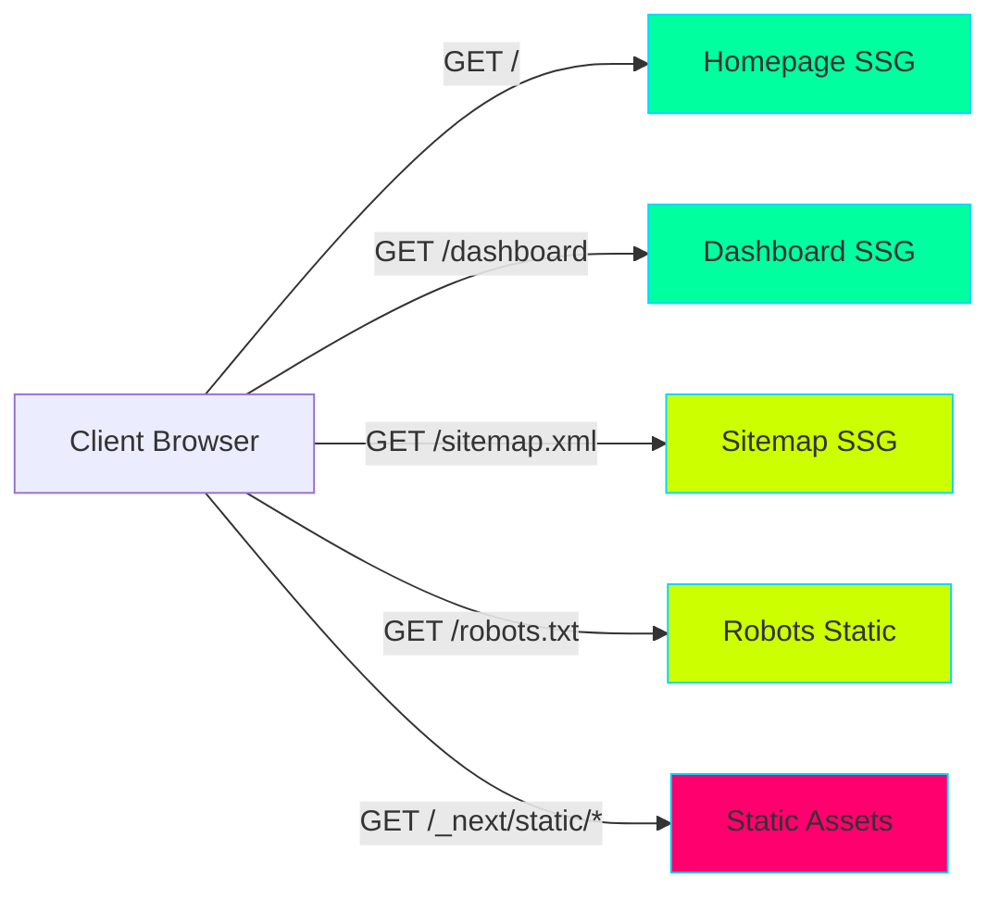

### Future API Routes (Phase 3)

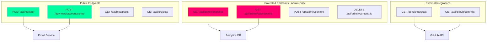

### Permission Scopes

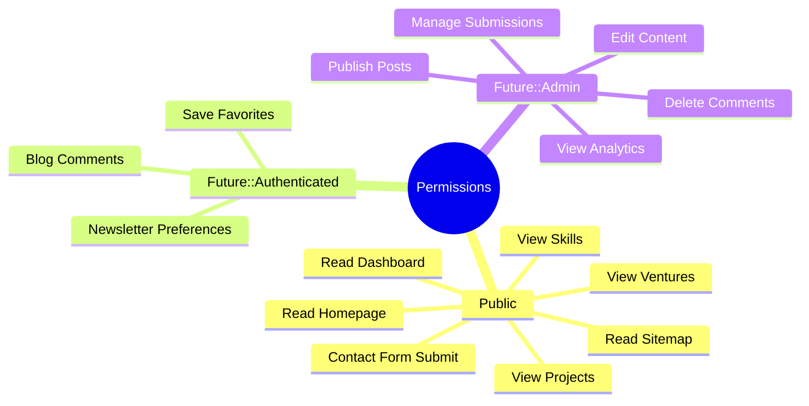

---

## Component Interaction Flow

### Hero Terminal Component

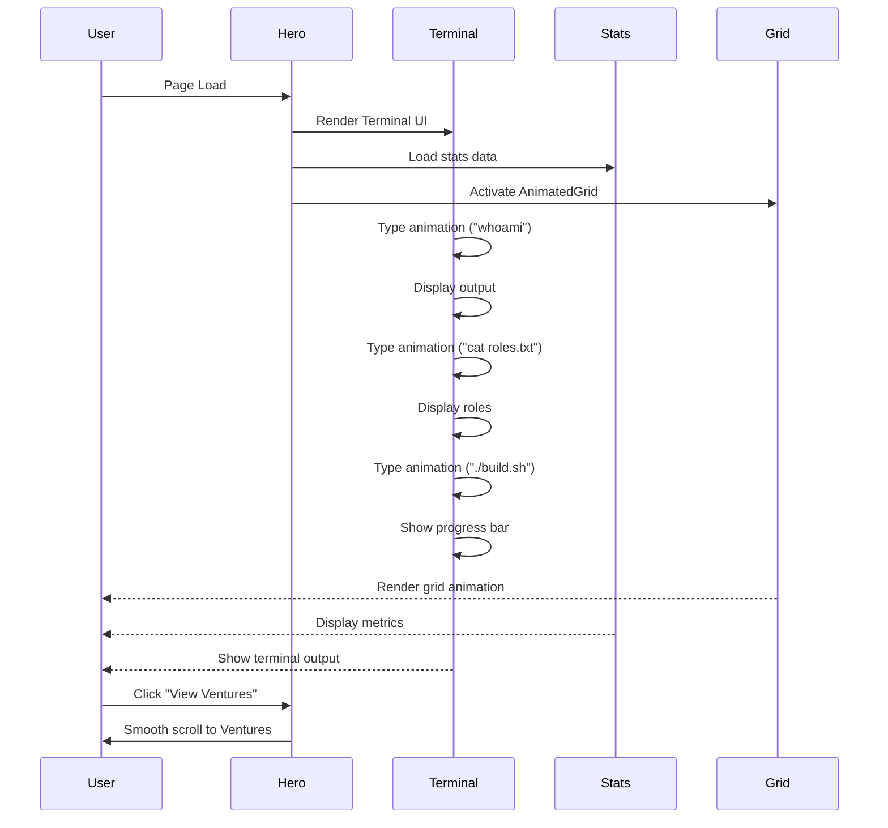

### Command Palette Interaction

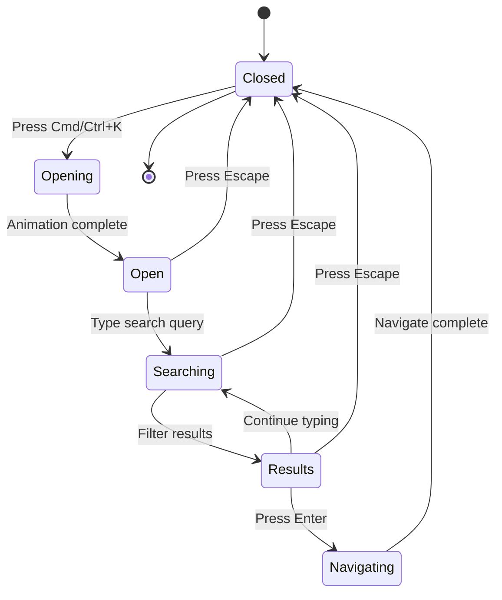

---

## Notes

1. **ASCII Representations** are approximate visual guides. Actual rendering uses HTML/CSS with Terminal Neon styling.
2. **Mermaid Diagrams** can be viewed in any Markdown viewer that supports Mermaid (GitHub, GitLab, VS Code, etc.)
3. **Permission Scopes** are currently all public. Future phases will add authentication.
4. **Endpoint Mapping** shows current SSG routes and planned API routes for Phase 3.
5. **Component Flow** demonstrates the interaction patterns and state management.

---

**Last Updated**: 2026-02-14
**Issue**: #136 - Part 2 (ASCII & Mermaid Diagrams)
**Status**: Complete
