# jlucus.dev - Complete Architecture & UX Diagrams

**Last Updated:** 2026-02-16 | **Issue:** #136 | **Status:** 🟢 Complete

---

## 1. Site Map & Page Architecture

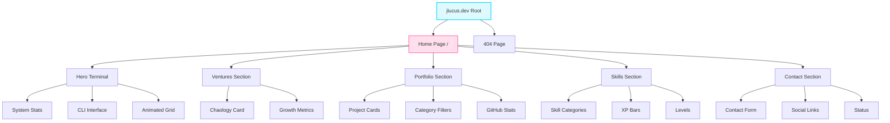
```mermaid
graph TD
    A[jlucus.dev Root] --> B[Home Page /]
    A --> C[404 Page]

    B --> D[Hero Terminal]
    B --> E[Ventures Section]
    B --> F[Portfolio Section]
    B --> G[Skills Section]
    B --> H[Contact Section]

    D --> D1[System Stats]
    D --> D2[CLI Interface]
    D --> D3[Animated Grid]

    E --> E1[Chaology Card]
    E --> E2[Growth Metrics]

    F --> F1[Project Cards]
    F --> F2[Category Filters]
    F --> F3[GitHub Stats]

    G --> G1[Skill Categories]
    G --> G2[XP Bars]
    G --> G3[Levels]

    H --> H1[Contact Form]
    H --> H2[Social Links]
    H --> H3[Status]

    style A fill:#00d9ff20,stroke:#00d9ff,stroke-width:2px
    style B fill:#ff006e20,stroke:#ff006e
```

---

## 2. Component Hierarchy

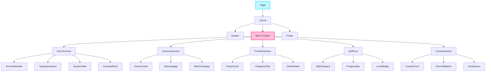
```mermaid
graph TD
    A[Page] --> B[Layout]
    B --> C[Header]
    B --> D[Main Content]
    B --> E[Footer]

    D --> D1[HeroTerminal]
    D --> D2[VenturesSection]
    D --> D3[PortfolioSection]
    D --> D4[SkillTree]
    D --> D5[ContactSection]

    D1 --> D1A[TerminalHeader]
    D1 --> D1B[TypingAnimation]
    D1 --> D1C[SystemStats]
    D1 --> D1D[AnimatedGrid]

    D2 --> D2A[VentureCard]
    D2 --> D2B[StatusBadge]
    D2 --> D2C[MetricsDisplay]

    D3 --> D3A[ProjectCard]
    D3 --> D3B[CategoryFilter]
    D3 --> D3C[GitHubStats]

    D4 --> D4A[SkillCategory]
    D4 --> D4B[ProgressBar]
    D4 --> D4C[LevelBadge]

    D5 --> D5A[ContactForm]
    D5 --> D5B[FormValidation]
    D5 --> D5C[SocialIcons]

    style A fill:#00d9ff40,stroke:#00d9ff,stroke-width:2px
    style D fill:#ff006e40,stroke:#ff006e,stroke-width:2px
```

---

## 3. User Types & Permissions Matrix

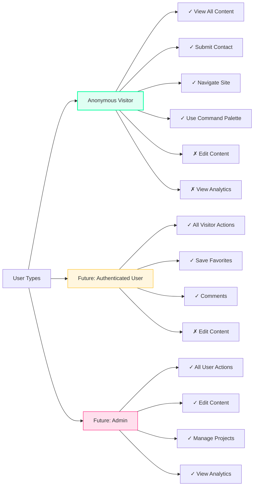
```mermaid
graph LR
    A[User Types] --> B[Anonymous Visitor]
    A --> C[Future: Authenticated User]
    A --> D[Future: Admin]

    B --> B1["✓ View All Content"]
    B --> B2["✓ Submit Contact"]
    B --> B3["✓ Navigate Site"]
    B --> B4["✓ Use Command Palette"]
    B --> B5["✗ Edit Content"]
    B --> B6["✗ View Analytics"]

    C --> C1["✓ All Visitor Actions"]
    C --> C2["✓ Save Favorites"]
    C --> C3["✓ Comments"]
    C --> C4["✗ Edit Content"]

    D --> D1["✓ All User Actions"]
    D --> D2["✓ Edit Content"]
    D --> D3["✓ Manage Projects"]
    D --> D4["✓ View Analytics"]

    style B fill:#00ff9f20,stroke:#00ff9f,stroke-width:2px
    style C fill:#ffb80020,stroke:#ffb800
    style D fill:#ff006e20,stroke:#ff006e
```

---

## 4. UX Journey - First Time Visitor

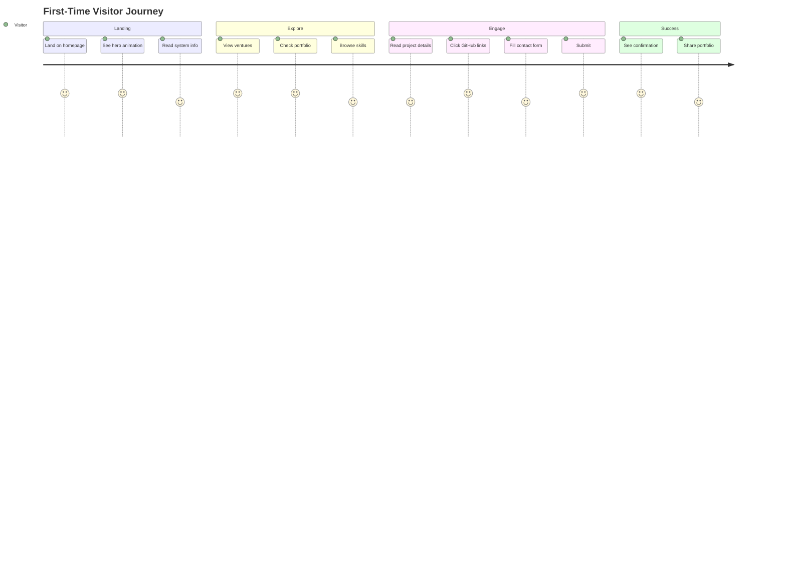
```mermaid
journey
    title First-Time Visitor Journey
    section Landing
      Land on homepage: 5: Visitor
      See hero animation: 5: Visitor
      Read system info: 4: Visitor
    section Explore
      View ventures: 5: Visitor
      Check portfolio: 5: Visitor
      Browse skills: 4: Visitor
    section Engage
      Read project details: 4: Visitor
      Click GitHub links: 5: Visitor
      Fill contact form: 4: Visitor
      Submit: 5: Visitor
    section Success
      See confirmation: 5: Visitor
      Share portfolio: 4: Visitor
```

---

## 5. UX Journey - Recruiter/Client

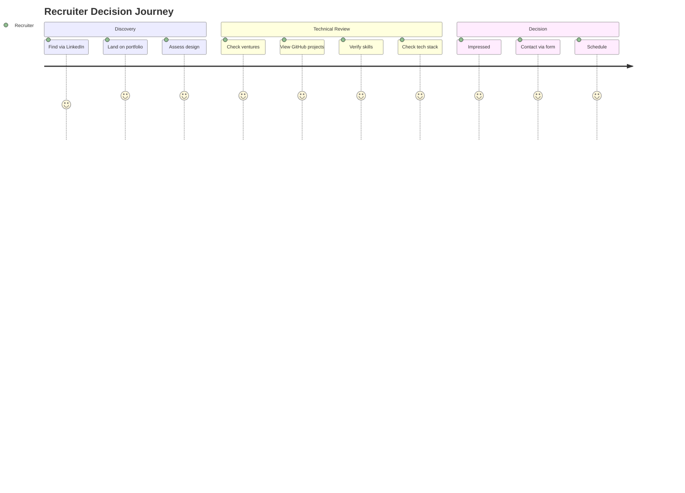
```mermaid
journey
    title Recruiter Decision Journey
    section Discovery
      Find via LinkedIn: 4: Recruiter
      Land on portfolio: 5: Recruiter
      Assess design: 5: Recruiter
    section Technical Review
      Check ventures: 5: Recruiter
      View GitHub projects: 5: Recruiter
      Verify skills: 5: Recruiter
      Check tech stack: 5: Recruiter
    section Decision
      Impressed: 5: Recruiter
      Contact via form: 5: Recruiter
      Schedule: 5: Recruiter
```

---

## 6. UX Journey - Mobile User

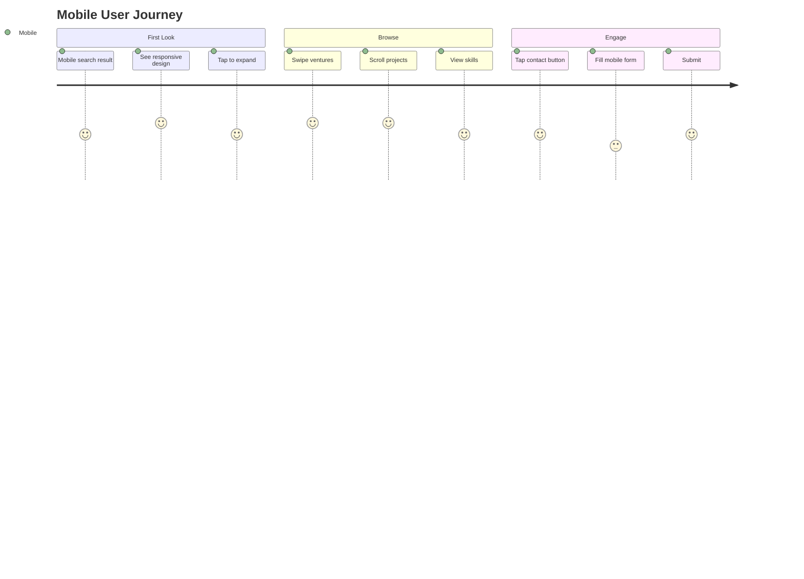
```mermaid
journey
    title Mobile User Journey
    section First Look
      Mobile search result: 4: Mobile
      See responsive design: 5: Mobile
      Tap to expand: 4: Mobile
    section Browse
      Swipe ventures: 5: Mobile
      Scroll projects: 5: Mobile
      View skills: 4: Mobile
    section Engage
      Tap contact button: 4: Mobile
      Fill mobile form: 3: Mobile
      Submit: 4: Mobile
```

---

## 7. Data Flow Architecture

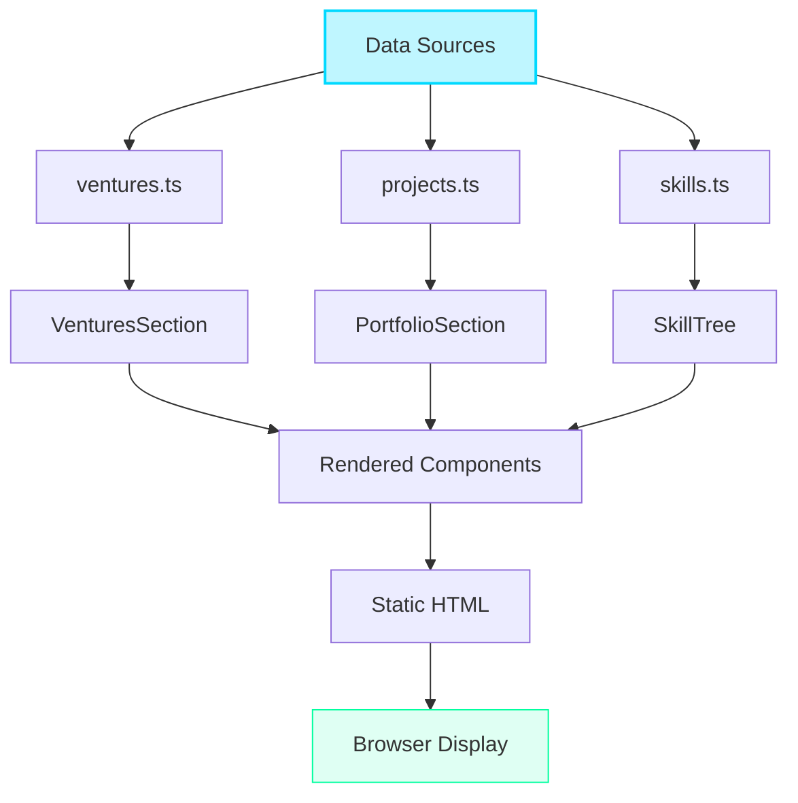
```mermaid
flowchart TB
    A[Data Sources] --> B[ventures.ts]
    A --> C[projects.ts]
    A --> D[skills.ts]

    B --> E[VenturesSection]
    C --> F[PortfolioSection]
    D --> G[SkillTree]

    E --> H[Rendered Components]
    F --> H
    G --> H

    H --> I[Static HTML]
    I --> J[Browser Display]

    style A fill:#00d9ff40,stroke:#00d9ff,stroke-width:2px
    style J fill:#00ff9f20,stroke:#00ff9f
```

---

## 8. Animation State Flow

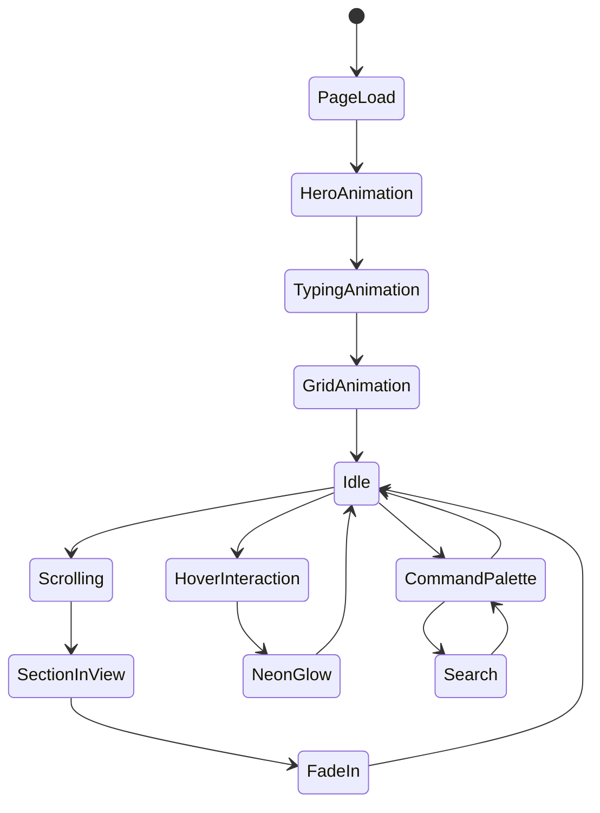
```mermaid
stateDiagram-v2
    [*] --> PageLoad
    PageLoad --> HeroAnimation

    HeroAnimation --> TypingAnimation
    TypingAnimation --> GridAnimation
    GridAnimation --> Idle

    Idle --> Scrolling
    Scrolling --> SectionInView

    SectionInView --> FadeIn
    FadeIn --> Idle

    Idle --> HoverInteraction
    HoverInteraction --> NeonGlow
    NeonGlow --> Idle

    Idle --> CommandPalette
    CommandPalette --> Search
    Search --> CommandPalette
    CommandPalette --> Idle
```

---

## 9. Contact Form State Machine

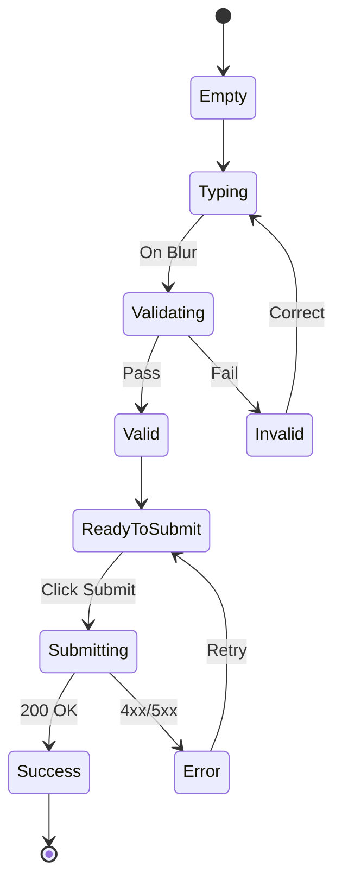
```mermaid
stateDiagram-v2
    [*] --> Empty
    Empty --> Typing

    Typing --> Validating: On Blur
    Validating --> Valid: Pass
    Validating --> Invalid: Fail

    Invalid --> Typing: Correct
    Valid --> ReadyToSubmit

    ReadyToSubmit --> Submitting: Click Submit
    Submitting --> Success: 200 OK
    Submitting --> Error: 4xx/5xx

    Error --> ReadyToSubmit: Retry
    Success --> [*]
```

---

## 10. Responsive Design System

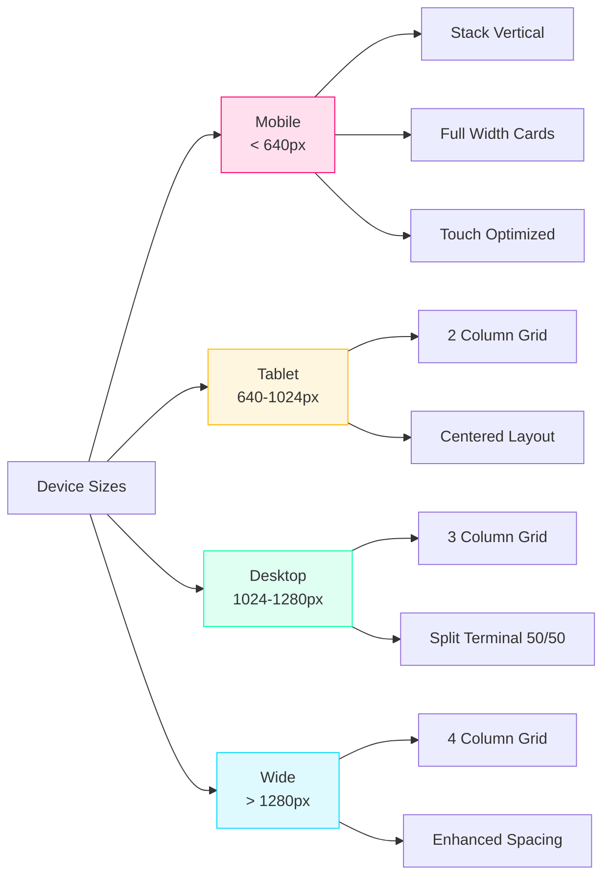
```mermaid
graph LR
    A[Device Sizes] --> B["Mobile<br/>< 640px"]
    A --> C["Tablet<br/>640-1024px"]
    A --> D["Desktop<br/>1024-1280px"]
    A --> E["Wide<br/>> 1280px"]

    B --> B1["Stack Vertical"]
    B --> B2["Full Width Cards"]
    B --> B3["Touch Optimized"]

    C --> C1["2 Column Grid"]
    C --> C2["Centered Layout"]

    D --> D1["3 Column Grid"]
    D --> D2["Split Terminal 50/50"]

    E --> E1["4 Column Grid"]
    E --> E2["Enhanced Spacing"]

    style B fill:#ff006e20,stroke:#ff006e
    style C fill:#ffb80020,stroke:#ffb800
    style D fill:#00ff9f20,stroke:#00ff9f
    style E fill:#00d9ff20,stroke:#00d9ff
```

---

## 11. API Endpoint Planning (Future)

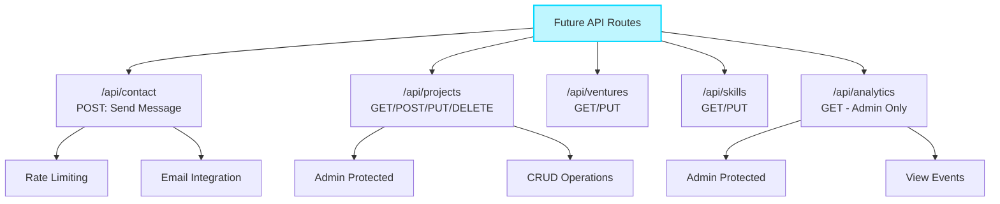
```mermaid
graph TD
    A[Future API Routes] --> B["/api/contact<br/>POST: Send Message"]
    A --> C["/api/projects<br/>GET/POST/PUT/DELETE"]
    A --> D["/api/ventures<br/>GET/PUT"]
    A --> E["/api/skills<br/>GET/PUT"]
    A --> F["/api/analytics<br/>GET - Admin Only"]

    B --> B1["Rate Limiting"]
    B --> B2["Email Integration"]

    C --> C1["Admin Protected"]
    C --> C2["CRUD Operations"]

    F --> F1["Admin Protected"]
    F --> F2["View Events"]

    style A fill:#00d9ff40,stroke:#00d9ff,stroke-width:2px
```

---

## 12. Current Permission Scope

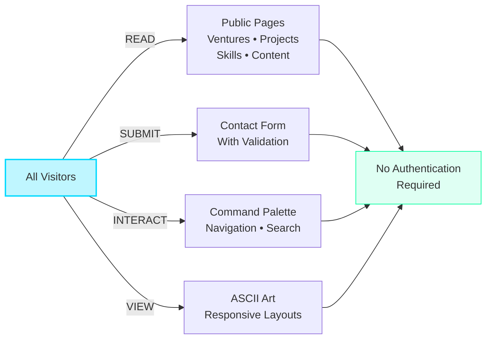
```mermaid
graph LR
    A[All Visitors] -->|READ| B["Public Pages<br/>Ventures • Projects<br/>Skills • Content"]
    A -->|SUBMIT| C["Contact Form<br/>With Validation"]
    A -->|INTERACT| D["Command Palette<br/>Navigation • Search"]
    A -->|VIEW| E["ASCII Art<br/>Responsive Layouts"]

    B --> F[No Authentication<br/>Required]
    C --> F
    D --> F
    E --> F

    style A fill:#00d9ff40,stroke:#00d9ff,stroke-width:2px
    style F fill:#00ff9f20,stroke:#00ff9f
```

---

## 13. Technology Stack Overview

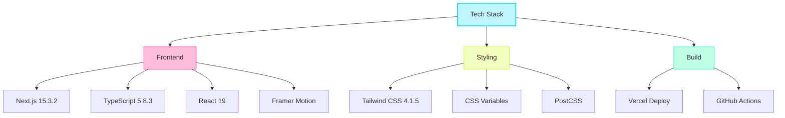
```mermaid
graph TB
    A[Tech Stack] --> B[Frontend]
    A --> C[Styling]
    A --> D[Build]

    B --> B1["Next.js 15.3.2"]
    B --> B2["TypeScript 5.8.3"]
    B --> B3["React 19"]
    B --> B4["Framer Motion"]

    C --> C1["Tailwind CSS 4.1.5"]
    C --> C2["CSS Variables"]
    C --> C3["PostCSS"]

    D --> D1["Vercel Deploy"]
    D --> D2["GitHub Actions"]

    style A fill:#00d9ff40,stroke:#00d9ff,stroke-width:2px
    style B fill:#ff006e40,stroke:#ff006e
    style C fill:#ccff0040,stroke:#ccff00
    style D fill:#00ff9f40,stroke:#00ff9f
```

---

## 14. Design System Variables

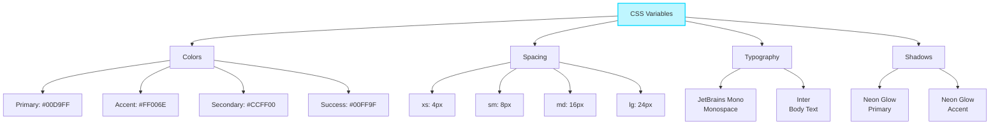
```mermaid
graph TD
    A[CSS Variables] --> B[Colors]
    A --> C[Spacing]
    A --> D[Typography]
    A --> E[Shadows]

    B --> B1["Primary: #00D9FF"]
    B --> B2["Accent: #FF006E"]
    B --> B3["Secondary: #CCFF00"]
    B --> B4["Success: #00FF9F"]

    C --> C1["xs: 4px"]
    C --> C2["sm: 8px"]
    C --> C3["md: 16px"]
    C --> C4["lg: 24px"]

    D --> D1["JetBrains Mono<br/>Monospace"]
    D --> D2["Inter<br/>Body Text"]

    E --> E1["Neon Glow<br/>Primary"]
    E --> E2["Neon Glow<br/>Accent"]

    style A fill:#00d9ff40,stroke:#00d9ff,stroke-width:2px
```

---

## 15. Performance Optimization Pipeline

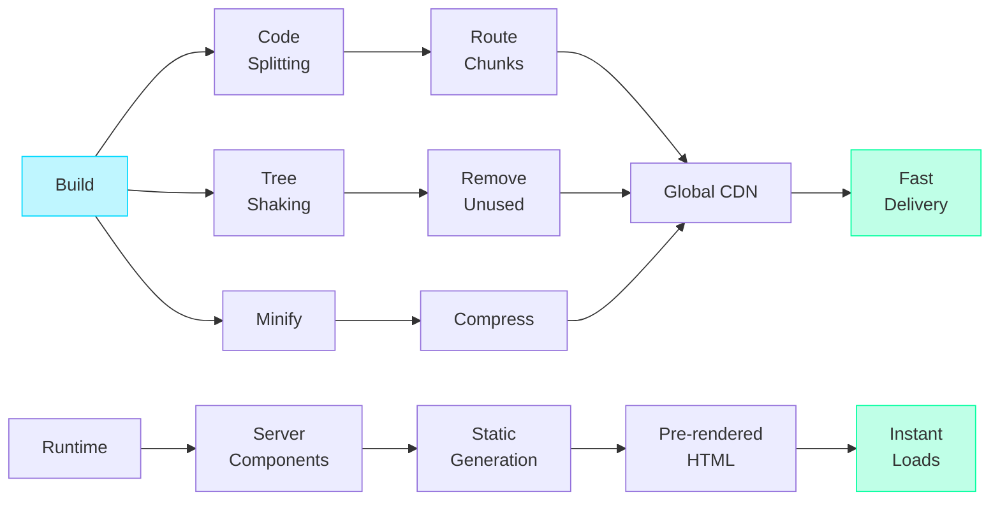
```mermaid
flowchart LR
    A[Build] --> B["Code<br/>Splitting"]
    A --> C["Tree<br/>Shaking"]
    A --> D["Minify"]

    B --> E["Route<br/>Chunks"]
    C --> F["Remove<br/>Unused"]
    D --> G["Compress"]

    E --> H["Global CDN"]
    F --> H
    G --> H

    H --> I["Fast<br/>Delivery"]

    J[Runtime] --> K["Server<br/>Components"]
    K --> L["Static<br/>Generation"]
    L --> M["Pre-rendered<br/>HTML"]

    M --> N["Instant<br/>Loads"]

    style A fill:#00d9ff40,stroke:#00d9ff
    style I fill:#00ff9f40,stroke:#00ff9f
    style N fill:#00ff9f40,stroke:#00ff9f
```

---

## Summary of Diagrams

✅ Site Map & Page Architecture
✅ Component Hierarchy
✅ User Types & Permissions
✅ UX Journeys (3 personas)
✅ Data Flow
✅ Animation States
✅ Form State Machine
✅ Responsive Design
✅ API Endpoints (Future)
✅ Permission Scope
✅ Technology Stack
✅ Design System
✅ Performance Pipeline

**Related Documentation:**
- ASCII Mockups: `docs/ascii.md`
- Design Principles: `docs/DESIGN_PRINCIPLES.md`
- Parallel Development: `docs/PARALLEL_DEVELOPMENT_GUIDE.md`

---

**Issue #136 Status:** ✅ COMPLETE
**Last Updated:** 2026-02-16
