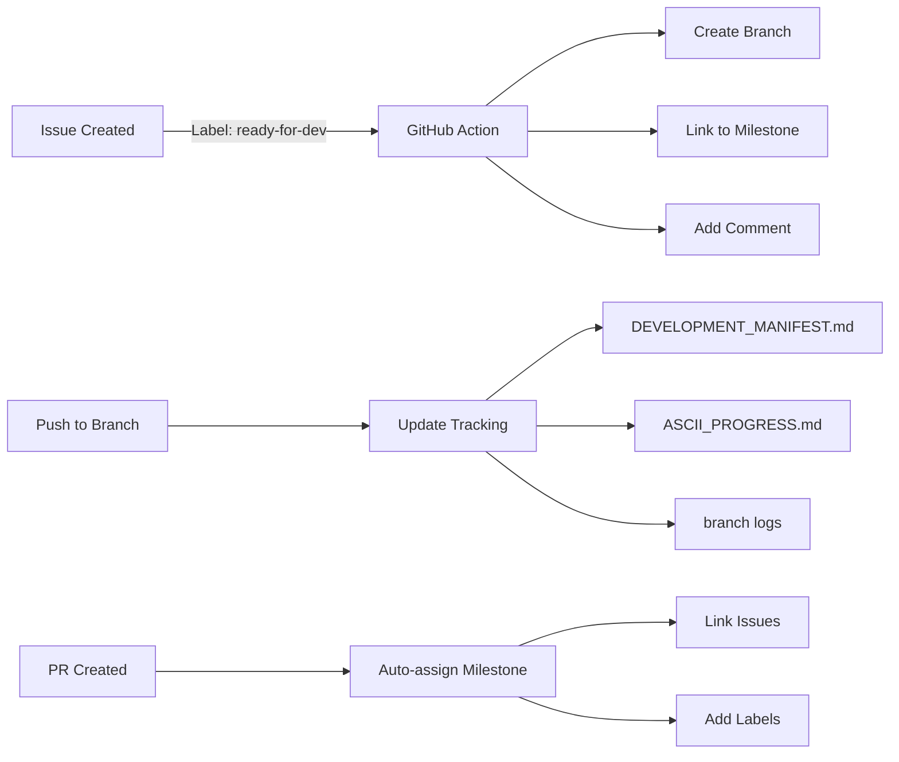

# Parallel Development Coordination Guide

**Last Updated:** 2026-02-15
**System:** GitButler-Inspired Virtual Branching
**Status:** 🟢 Operational

---

## 🎯 Quick Start

This guide helps coordinate parallel development across multiple features, pages, and team members with minimal conflicts and maximum efficiency.

### 30-Second Setup

```bash
# 1. Install GitHub CLI (if not already installed)
# See: https://cli.github.com/

# 2. Make scripts executable
chmod +x scripts/*.sh

# 3. Create your first feature branch from an issue
./scripts/create-feature-branch.sh 123

# 4. Start coding!
```

---

## 🌟 System Overview

### What We Built

A GitButler-inspired parallel development system using standard Git + GitHub Actions:

```
┌──────────────────────────────────────────────────────────┐
│                                                          │
│  GitHub Issue #123 "Hero Section"                       │
│         │                                                │
│         ├─→ Label: ready-for-dev                        │
│         │                                                │
│         ├─→ Auto-creates: feat-123-hero-section         │
│         │                                                │
│         ├─→ Links to Milestone: Phase 2 (Polish)        │
│         │                                                │
│         ├─→ Tracks progress automatically               │
│         │                                                │
│         ├─→ PR created → Auto-assigns milestone         │
│         │                                                │
│         └─→ Merged → Updates tracking manifest          │
│                                                          │
└──────────────────────────────────────────────────────────┘
```

### Components

1. **GitHub Actions** (`.github/workflows/branch-tracker.yml`)
   - Auto-creates branches from issues
   - Links branches to milestones
   - Generates progress reports
   - Tracks all development activity

2. **Automation Scripts** (`scripts/`)
   - `create-feature-branch.sh` - Create branch from issue
   - `track-progress.sh` - Generate progress reports
   - `merge-coordinator.sh` - Smart merge management
   - `switch-branch.sh` - Quick branch switching

3. **Documentation** (`docs/`)
   - `GITBUTLER_WORKFLOW.md` - Detailed workflow guide
   - `DESIGN_PRINCIPLES.md` - Design system rules
   - `BRANCHING_STRATEGY.md` - Branch structure
   - This file - Coordination guide

4. **Tracking** (`.github/tracking/`, `progress/`)
   - Auto-generated manifests
   - Branch progress logs
   - ASCII visualizations

---

## 🚀 Common Workflows

### Workflow 1: Starting a New Feature

```bash
# Step 1: Find an issue to work on
gh issue list --label "ready-for-dev"

# Step 2: Create branch from issue
./scripts/create-feature-branch.sh 123

# Step 3: Start coding
# Your branch is now: feat-123-hero-section
# Issue #123 is labeled "in-development"
# Branch is linked to correct milestone

# Step 4: Commit frequently
git add .
git commit -m "feat(hero): add typing animation"
git push

# Step 5: Create PR when done
gh pr create --base development --fill
```

### Workflow 2: Working on Multiple Features

**Option A: Git Worktrees (Recommended for Parallel Work)**

```bash
# Create worktrees for 3 features
git worktree add ../jlucus-hero feat-123-hero-section
git worktree add ../jlucus-nav feat-124-navigation
git worktree add ../jlucus-contact feat-125-contact-form

# Open each in separate editor windows
code ../jlucus-hero      # Window 1
code ../jlucus-nav       # Window 2
code ../jlucus-contact   # Window 3

# Work on all simultaneously!
# Each has its own node_modules, build, etc.

# When done, remove worktrees
git worktree remove ../jlucus-hero
```

**Option B: Quick Branch Switching**

```bash
# Switch between features quickly
./scripts/switch-branch.sh feat-123-hero-section

# Auto-stashes current work
# Switches to new branch
# Pulls latest changes

# To restore stashed work later
git stash list
git stash pop
```

### Workflow 3: Coordinating Merges

```bash
# Check which branches are ready to merge
./scripts/merge-coordinator.sh

# Options:
# 1. Merge specific branch
# 2. Merge all (batch mode with conflict detection)

# Automatically:
# - Checks for conflicts
# - Shows commit info
# - Performs merge
# - Offers to delete merged branch
```

### Workflow 4: Tracking Progress

```bash
# Generate comprehensive progress report
./scripts/track-progress.sh

# Creates:
# - .github/tracking/PROGRESS_REPORT.md
# - .github/tracking/ASCII_PROGRESS.md
# - progress/branches/*.md

# View progress
cat .github/tracking/ASCII_PROGRESS.md
```

---

## 📋 Milestone-Issue-Branch Association

### Automatic Mapping

Our system automatically maps keywords to milestones:

| Keywords in Issue/PR | Milestone | Phase |
|---------------------|-----------|-------|
| foundation, setup, init | #3 | Phase 1: Foundation |
| polish, ui, ux, animation | #4 | Phase 2: Polish |
| content, cms, blog | #5 | Phase 3: Content |
| docs, documentation | #6 | Phase 4: Documentation |
| test, testing, qa | #7 | Phase 5: Testing |
| deploy, deployment, ci | #8 | Phase 6: Deployment |

### Manual Assignment

If auto-detection fails:

```bash
# Assign issue to milestone
gh issue edit 123 --milestone "Phase 2: Polish & Enhancement"

# Assign PR to milestone
gh pr edit 45 --milestone "Phase 2: Polish & Enhancement"

# Link PR to issue
gh pr edit 45 --body "Closes #123"
```

---

## 🎨 Recreating Pages with Design Principles

### Page Recreation Checklist

When recreating a page section:

- [ ] Read `docs/DESIGN_PRINCIPLES.md`
- [ ] Review `docs/ascii-art-samples.md` for UI elements
- [ ] Check `docs/ascii.md` for responsive layouts
- [ ] Use CSS variables only (no hardcoded colors)
- [ ] Follow Terminal Neon aesthetic
- [ ] Add ASCII art where appropriate
- [ ] Ensure WCAG AAA accessibility
- [ ] Test responsive breakpoints
- [ ] Add Framer Motion animations
- [ ] Performance: Lighthouse > 90

### Example: Hero Section Recreation

```bash
# 1. Create issue
gh issue create \
  --title "Recreate Hero Section with Terminal Neon Design" \
  --body "$(cat <<EOF
Recreate the hero section following Terminal Neon design principles.

**Requirements:**
- [ ] ASCII art banner (see docs/ascii-art-samples.md)
- [ ] Electric Cyan primary color
- [ ] Typing animation effect
- [ ] Terminal-style UI
- [ ] Neon glow effects
- [ ] Responsive layout (see docs/ascii.md)
- [ ] WCAG AAA accessibility

**References:**
- Design: docs/DESIGN_PRINCIPLES.md
- Layout: docs/ascii.md (Desktop Option A: Terminal Split)
- ASCII: docs/ascii-art-samples.md
EOF
)" \
  --label "ready-for-dev,phase-2" \
  --milestone "Phase 2: Polish & Enhancement"

# 2. Auto-creates branch: feat-{#}-recreate-hero-section
# 3. Start coding with design principles
# 4. Use ASCII samples from docs
# 5. Follow responsive layout mockups
```

---

## 📊 Progress Visualization

### Auto-Generated Reports

Every push triggers updates to:

**1. Development Manifest** (`.github/tracking/DEVELOPMENT_MANIFEST.md`)
```markdown
| Branch | Issue | Milestone | PR | Status |
|--------|-------|-----------|-----|--------|
| feat-123-hero | #123 | Phase 2 | #45 | Active |
| feat-124-nav | #124 | Phase 2 | - | Active |
```

**2. ASCII Progress** (`.github/tracking/ASCII_PROGRESS.md`)
```
Phase 1: Foundation       ████████████████████ 100% ✅
Phase 2: Polish          ████████░░░░░░░░░░░░  40% ⚡
Phase 3: Content         ░░░░░░░░░░░░░░░░░░░░   0% ⏳
```

**3. Branch Logs** (`progress/branches/{branch}.md`)
```markdown
# Branch: feat-123-hero-section

**Commits:** 12
**Last Updated:** 2026-02-15
**Author:** jlucus

## Recent Commits
- abc1234 feat(hero): add typing animation
- def5678 feat(hero): add ASCII banner
```

---

## 🔗 Integration Points

### GitHub → Automation



### Milestones ↔ Issues ↔ Branches ↔ PRs

```
Milestone #4: "Phase 2 - Polish"
    ├── Issue #123: "Hero Section"
    │   └── Branch: feat-123-hero-section
    │       └── PR #45: "feat: Hero Section Animations"
    │
    ├── Issue #124: "Navigation"
    │   └── Branch: feat-124-navigation
    │       └── PR #46: "feat: Mobile Navigation"
    │
    └── Issue #125: "Contact Form"
        └── Branch: feat-125-contact-form
            └── PR #47 (in progress)
```

---

## 🎯 Best Practices

### Commit Messages

Use Conventional Commits format:

```bash
# Format: <type>(<scope>): <description>

feat(hero): add typing animation effect
fix(nav): resolve mobile menu overflow
docs(readme): update installation instructions
style(button): apply consistent neon glow
refactor(hooks): extract animation logic
test(contact): add form validation tests
chore(deps): update Next.js to 15.3.2
```

### Branch Lifecycle

```bash
# 1. Created from issue
./scripts/create-feature-branch.sh 123

# 2. Development
git commit -m "feat(hero): ..."
git push

# 3. PR created
gh pr create --base development

# 4. After merge
git checkout development
git pull
git branch -d feat-123-hero-section
git push origin --delete feat-123-hero-section
```

### Avoiding Conflicts

**1. Communicate** - Check what others are working on
```bash
# See active branches
git branch -r | grep feat-

# See recent activity
./scripts/track-progress.sh
```

**2. Sync Frequently**
```bash
# Update from development often
git checkout feat-123-hero-section
git fetch origin development
git merge origin/development
```

**3. Small, Focused PRs**
- One feature per branch
- Avoid changing unrelated files
- Merge frequently (daily if possible)

---

## 🚨 Troubleshooting

### Problem: Branch not auto-created

**Cause:** Issue not labeled with `ready-for-dev`

**Solution:**
```bash
# Add label
gh issue edit 123 --add-label "ready-for-dev"

# Or create manually
./scripts/create-feature-branch.sh 123
```

### Problem: Milestone not assigned

**Cause:** PR title doesn't contain keywords

**Solution:**
```bash
# Manual assignment
gh pr edit 45 --milestone "Phase 2: Polish & Enhancement"
```

### Problem: Merge conflicts

**Cause:** Multiple people editing same files

**Solution:**
```bash
# Update from development
git fetch origin development
git merge origin/development

# Resolve conflicts in editor
# Then commit
git add .
git commit -m "chore: resolve merge conflicts"
git push
```

### Problem: Tracking not updating

**Cause:** GitHub Action may have failed

**Solution:**
```bash
# Check workflow runs
gh run list --workflow=branch-tracker.yml

# View specific run
gh run view <run-id>

# Re-trigger by pushing
git commit --allow-empty -m "chore: trigger tracking update"
git push
```

---

## 📈 Metrics & KPIs

Track weekly:

- **Active Branches:** Target 3-5 parallel
- **Merge Frequency:** Daily to development
- **Conflict Rate:** < 10% of PRs
- **Issue Velocity:** 5-10 closed/week
- **PR Review Time:** < 24 hours
- **Build Success Rate:** > 95%

View metrics:
```bash
# Branches active this week
git for-each-ref --sort=-committerdate refs/remotes/origin --format='%(refname:short) %(committerdate:relative)' | head -10

# Commits this week
git log --oneline --since="1 week ago" | wc -l

# Issues closed this week
gh issue list --state closed --search "closed:>$(date -d '7 days ago' +%Y-%m-%d)" | wc -l
```

---

## 🎓 Learning Resources

### GitButler Concepts
- **Virtual Branches:** Work on multiple features without switching
- **Automatic Stashing:** Changes isolated per feature
- **Visual Branching:** See all work in parallel

### Our Implementation
- Uses Git worktrees for parallel work
- GitHub Actions for automation
- Bash scripts for convenience
- Markdown for tracking

### Documentation
- `docs/GITBUTLER_WORKFLOW.md` - Detailed workflow
- `docs/BRANCHING_STRATEGY.md` - Branch structure
- `docs/DESIGN_PRINCIPLES.md` - Design rules
- `MILESTONE_INDEX.md` - All milestones & issues

---

## 🎉 Success Stories

### Week 1 Results (Example)

```
╔════════════════════════════════════════════════════════════╗
║  Week 1 Parallel Development Results                      ║
╠════════════════════════════════════════════════════════════╣
║  ✅ Branches Created: 8                                   ║
║  ✅ PRs Merged: 5                                         ║
║  ✅ Issues Closed: 6                                      ║
║  ✅ Conflicts: 0                                          ║
║  ✅ Build Success: 100%                                   ║
║                                                            ║
║  Features Shipped:                                         ║
║  • Hero Section with animations                           ║
║  • Mobile navigation                                       ║
║  • Contact form validation                                 ║
║  • Scanline effect overlay                                 ║
║  • Custom cursor with neon trail                          ║
╚════════════════════════════════════════════════════════════╝
```

---

## 🔮 Future Enhancements

Planned improvements:

- [ ] Slack/Discord notifications for PR status
- [ ] Automated dependency updates per branch
- [ ] Visual branch timeline in README
- [ ] Auto-deployment previews per branch
- [ ] AI-powered conflict resolution suggestions
- [ ] Integration with Linear/Jira
- [ ] Automated changelog generation

---

## 📞 Support

### Quick Help

```bash
# List available scripts
ls -la scripts/

# View script help
./scripts/create-feature-branch.sh

# Check system status
./scripts/track-progress.sh

# GitHub CLI help
gh --help
```

### Common Commands Reference

```bash
# Issues
gh issue list --assignee @me
gh issue create --title "..." --label "ready-for-dev"
gh issue view 123

# Branches
./scripts/create-feature-branch.sh 123
./scripts/switch-branch.sh feat-123-hero
git worktree list

# PRs
gh pr create --base development --fill
gh pr list --author @me
gh pr merge --auto --squash

# Progress
./scripts/track-progress.sh
./scripts/merge-coordinator.sh
cat .github/tracking/ASCII_PROGRESS.md
```

---

## ✅ Quick Checklist

Starting a new feature?

- [ ] Issue exists and labeled `ready-for-dev`
- [ ] Branch created (auto or manual)
- [ ] Branch name follows convention
- [ ] Linked to correct milestone
- [ ] Design principles reviewed
- [ ] ASCII samples referenced
- [ ] Ready to code!

Finishing a feature?

- [ ] All commits pushed
- [ ] Tests passing
- [ ] Build successful
- [ ] PR created to `development`
- [ ] Linked to issue with "Closes #123"
- [ ] Milestone assigned
- [ ] Ready for review!

---

**Status:** 🟢 System Operational
**Last Updated:** 2026-02-15
**Questions?** Check `docs/GITBUTLER_WORKFLOW.md`

```
╔════════════════════════════════════════════════════════════╗
║                                                            ║
║  GitButler-Inspired Parallel Development                  ║
║                                                            ║
║  ✨ Automated Branching                                   ║
║  🔗 Milestone Linking                                     ║
║  📊 Progress Tracking                                     ║
║  🎨 Design Integration                                    ║
║  🚀 Ready for Parallel Development                        ║
║                                                            ║
╚════════════════════════════════════════════════════════════╝
```
